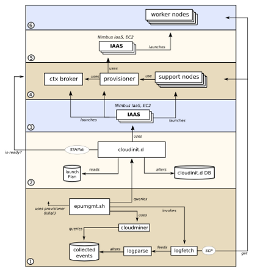

===============
After Bootstrap
===============

This page is part of the EPU's conceptual walkthrough, it assumes you have read the `EPU overview page <index.html>`_.

Worker Instances
================

Once cloudinit.d initiates an EPU-specific launch plan and confirms that each bootlevel was successful using its verification mechanisms, the EPU is off and running.

For each EPU-ified service, a non-zero "minimum instances" configuration might be in place in your launch plan. That will cause worker instances to be launched immediately via the EPU provisioner service.

At this point, there are now VM instances running under your credential that cloudinit.d does not know about.

EPU Mgmt Tool
=============

This is where epumgmt comes into play. epumgmt is a tool that inspects a cloudinit.d launch (via API) and looks for something named "provisioner" as well as any name with a prefix of "epu-".

Using this convention, it can then inspect the EPU system. For example, it can analyze log files for specific events. That helps for information purposes and troubleshooting as well as for running system-level tests.

Also, it is equipped with a mechanism to tear down the system (it can send a special signal to the provisioner service to shutdown all the workers). That is important to note because if you tear down with cloudinit.d, then you would leave the EPU worker instances running. We will learn the details below when it's time to launch and manage sample launch plans.

Diagram: System Interactions 
============================

In the following overview diagram, note for now the major sections.

* Section #2: cloudinit.d and launch-plans. The database here is based on SQLite: it's just a file, no need to worry about setting up any DB on the node.

* Section #3: cloudinit.d is itself configured with credentials to interact with one or more IaaS systems. It's here that the base system instances are started which is section #4.

* Section #4: any supporting infrastructure (like message brokers, context broker, and Cassandra instances for example) and the EPU infrastructure itself (the provisioner and EPU controllers etc).

* Section #5: When policy dictates, the EPU controllers use the provisioner to instantiate worker nodes (Section #6) using its own configured credentials and its own configured IaaS systems. In the samples below these will be the same IaaS and IaaS credentials as cloudinit.d used, though.

* Section #1: Use epumgmt to inspect the EPU infrastructure or terminate the entire system (including the worker nodes launched by the provisioner).

Click the image to see a larger version:

.. TODO: image is too close to text

EPU Controllers
===============
   
The "support nodes" in this diagram are the "EPU controllers" mentioned on the `EPU overview page <index.html>`_.

Each EPU-ified service in the system needs to have these "watching" services (an instance of "EPU controller") that make decisions about that particular service's worker node pool.

Decision Engines
================

Decisions about the number of instances (both to compensate failures and to expand and contract to handle workloads/deadlines) are based on sensor information and configured policies. The heart of the decision making process takes place in a "decision engine".

There are default implementations of the decision engine with many configurations but it is fully customizable if you drop to writing Python. There is an abstraction in place that splits the EPU controller service into two parts.

* The "outer shell" that takes care of all the messaging and persistence work to make the EPU behave as it should in the context of the EPU system as a whole.

* The decision engine itself is a configurable Python class that follows a certain fairly simple API and semantics for getting information about the system or carrying out changes in the system. The actual decision making logic can be as complex as you want for custom engines.

That would be for some pretty advanced cases: in the quickstart we are going to work with the default decision engine: npreserving.

N-preserving
============

The npreserving decision engine maintains a certain "N" number of worker instances. If one exhibits an issue, it will be replaced. You configure this number in the initial configuration but there is also a remote operation that lets you reconfigure it (the SQLStream/ANF dynamic controller integrates with this).

Queue-length
============

An alternative is the queue-length inspecting decision engine, this will not be used in the sample launches below. With that, the "queuelen_high_water" and "queuelen_low_water" cause the infrastructure to look at pending messages in the service's message queue to make decisions.

* When the high water is passed, the queue is considered backed-up and a compensating node is launched.
* When the queue's pending message count drops below the low water configuration, a node is taken away.
* If there is still work on the queue, the node count will not drop to zero.
* Also you can force the minimum node count (regardless of queuelen)

