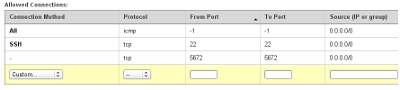

============
Dependencies
============

This page is part of the EPU quickstart, it assumes you have read the `EPU overview page <index.html>`_.

Now that you have some background, time to get started with some sample EPU launch plans.

There are prerequisites though, there are things you must install on a preexisting system and credentials you must obtain for preexisting services.

For most samples we will use the EC2 IaaS service.  The software is also regularly launched on Nimbus IaaS.  (Because cloudinit.d can support many IaaS systems, there are in theory many other options if base images are available.)

Dependencies you will need:

* Python 2.5+ (but not Python 3.x)
* virtualenv installation
* git installation
* EC2 credentials
* EC2 credentials for EPU infrastructure
* A default security group in EC2 that allows incoming connections to port 22 and port
* Context Broker credentials

Python
======

*Python 2.5+ (but not Python 3.x)*

Installed to your system via package manager. This has all only been tested on Linux and OSX.

.. code-block:: none
    
    $ python --version
    Python 2.6.6

virtualenv
==========

`virtualenv <http://pypi.python.org/pypi/virtualenv>`_ is the "Virtual Python Environment builder".  It allows you to create isolated Python environments that have the right sets of dependencies that also do not require root to install, wrapped in a convenient set of commands.

Install this to your system via the package manager.  Alternatively you can run this on most systems:

.. code-block:: none
    
    $ easy_install virtualenv

Run the following command to setup and activate a virtualenv for the quickstart:

.. code-block:: none
    
    $ cd /tmp  # sample directory
    $ virtualenv --no-site-packages --python=python2.6 epu
    $ cd /tmp/epu
    $ source bin/activate

After that last command you are now in a sandboxed Python environment and can install libraries at will (using "pip" or "easy_install" without needing a system account).

A nice thing to have is an alias that gets you into your different environments quickly, for example:

.. code-block:: none
    
    $ alias epu="source /tmp/epu/bin/activate && cd /tmp/epu"

git installation
================

`git <http://git-scm.com/>`_ is a version control tool that is widely available (you probably already have it installed on your system).

For the timebeing we will get some of the software directly from git (based on tags, so it will always be the same thing).  You do not need to know anything about git except if it is installed or not:

.. code-block:: none
    
    $ git

    
EC2 Credentials
===============

You will need to register with `Amazon Web Services <http://aws.amazon.com/>`_ and create an account to launch EC2 virtual machines. 

In your account you will find values for the *AWS_ACCESS_KEY_ID* and *AWS_SECRET_ACCESS_KEY* environment variables that most EC2 programs will pick up.  The access key/id has nothing to do with your main account ID number, they are listed in the credentials section of the control panel.

You will also need to register an SSH key with EC2 (the examples will use the US East region but go ahead and do both East and West for good measure). You can name it anything you like if you are just using cloudinit.d but convention for EPU things is to use the name 'epussh'.

For later, note the location of your EC2 SSH key (something like "~/.ssh/ec2.pem") and the values of the two mentioned environment variables.

EC2 Firewall
===============

You will need to use a default "security group" that opens port 22 (for SSH) and port 5672 (for RabbitMQ connections).

Here is what the tested one looks like in the AWS control panel (click the picture to enlarge it): 

.. TODO: image is too close to text

Context Broker
==============

The context broker is used to configure images that are started via the provisioner service.

In the near future these launch plans will run a context broker for you and configure the credentials automatically, but for now you should get an account on the public, standalone context broker.  Email nimbus@mcs.anl.gov for credentials.

If you already have a Nimbus IaaS installation, you can use the REST based context broker credentials configured in the authorization file.

For later, note the values of the context broker ID and secret key.

