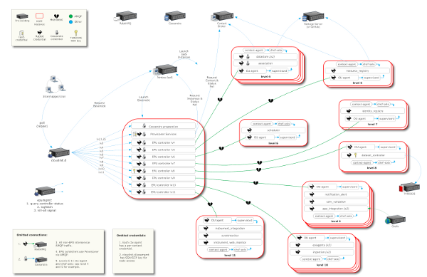

=====
OOICI
=====

This page is a special part of the EPU documentation, geared towards the administrators of the OOICI system, the most complicated launch plan we have to date.

This page assumes you have read the `EPU overview page <index.html>`_.

This page assumes you have also followed the `dependency <dependencies.html>`_ and `installation <install.html>`_ guides.

Warning
=======

This discusses *one use* of cloudinit.d for OOICI.  We use it in a particular pattern with particular tools (for example, Chef, which is not required).  If you want to do things differently, there is usually a way to make it happen.

Versions
========

No matter what the `installation <install.html>`_ instructions say to install, this page assumes you have the following versions of the launch software installed:

* cloudinit.d release: *1.0*
* epumgmt git tag: *previewR1*

Launch plan
===========

Retrieve the OOICI launch plan::

    $ git clone https://github.com/ooici/launch-plans.git
    $ cd launch-plans/R1/r1c3

There is no git tag to use yet.

There are a few different launch plans in this repository but the one of interest
is in ``R1/r1c3/``. The plan is organized into a directory per level (``00`` - ``11``)
plus an optional ``test`` level. There are two plan entry points: ``integration.conf``
and ``production.conf``.

While cloudinit.d can launch many VMs, in this plan it only launches one and starts many services on it. These services in turn are used to boot further VMs.

Levels
------

Each level has a directory under ``R1/r1c3/`` including its level ``.conf`` file
and other boot config files and scripts. To understand each level, start with the
conf and see how each other file is referenced and used.

Level 1
    base node launch and Cassandra keyspace creation for EPU

Level 2
    Cassandra keyspace creation for ioncore

Level 3
    EPU Provisioner service installed and started on basenode, in ``/home/cc``

Levels 4-11
    EPU Controller installed and started on basenode, in ``/home/epu*``. Each
    EPU Controller starts one or more worker VMs and waits for them to be ready
    before the level is completed. Note the ``lv*ready.py`` ready script in each
    level's directory.

Test Level (``test/``)
    This level is included in the integration plan only. It is run after level 11 and
    executes a series of integration test suites, to validate the running system.

Deployment Diagram
------------------

The full deployment of levels 1-10 and any pre-existing services can be seen together in the following diagram (click the image to see a larger version):

.. TODO: image is too close to text

Environment
===========

Before running the launch command, a number of environment variables are required for this launch plan.

All of these values could be part of the launch plan itself, but environment variables were chosen to make changing them faster or in the cases where the value is sensitive information like a password.

Making the environment variable definitions part of your virtualenv environment is a good way to always have them at the ready for a system launch.

Credentials for Provisioner: Nimbus IaaS and Context Broker
-----------------------------------------------------------

.. code-block:: bash

    export CTXBROKER_KEY=`cat ~/.secrets/CTXBROKER_KEY`
    export CTXBROKER_SECRET=`cat ~/.secrets/CTXBROKER_SECRET`
    export NIMBUS_KEY=`cat ~/.secrets/NIMBUS_KEY`
    export NIMBUS_SECRET=`cat ~/.secrets/NIMBUS_SECRET`
    
These are the credentials that the *provisioner* will use to launch worker VMs.

The context broker and IaaS credentials may or may not be different.  For OOICI they are usually the same credentials.  These are the key/secret pairs provided for the REST-style interfaces, not the X509 credentials.  The same key/secret is used with Cumulus.

Credentials for cloudinit.d: Nimbus IaaS
----------------------------------------

.. code-block:: bash

    export CLOUDBOOT_IAAS_ACCESS_KEY="$NIMBUS_KEY"
    export CLOUDBOOT_IAAS_SECRET_KEY="$NIMBUS_SECRET"

cloudinit.d only needs IaaS credentials, it does not use the context broker.  It can be configured to launch the base services anywhere but as depicted here it will probably use the same IaaS system and credentials that the provisioner service does.

Cassandra Credentials
---------------------

.. code-block:: bash

    export CASSANDRA_USERNAME="mamacass"
    export CASSANDRA_PASSWORD=`uuidgen`

You make these up if you are using EC2.  You have this running already if you are using a Nimbus cloud with R1.

    
Messaging Namespace
-------------------

.. code-block:: bash

    export EXCHANGE_SCOPE="sysname123"
    
If you are running your own Cassandra instance outside the launch plan, this HAS to change every launch.  If you are rebooting a system with data from a previous launch, this HAS to be the same as the previous launch.

Pre-existing services
---------------------

.. code-block:: bash

    export BROKER_HOSTNAME="rabbitmq-dev0.oceanobservatories.org"
    export CASSANDRA_HOSTNAME="cassandra.oceanobservatories.org"

These are set differently for production vs. integration tests.

Integration Mode
================

You probably want to try things with the integration mode turned on first.  This will fail out right away if there's a deployment problem or worker issue.  In other words, it turns off "high availability" mode to make it easier to spot integration problems.  To turn this mode off for "real" runs, run this:

.. code-block:: none

    $ cp common/devmode-off.conf common/devmode.conf 
   
There are other "switches" like this.  There is a file that controls what IaaS the provisioner uses (this is different than the IaaS that cloudinit.d is configured with).  Override the default like so:
   
.. code-block:: none

    $ cp common/iaas-old.conf common/iaas.conf
   
And there is a file that controls what THREDDS server to use. Override the default like so:
   
.. code-block:: none

    $ cp common/thredds-test.conf common/thredds.conf

Launch
======

.. code-block:: none

    $ cloudinitd boot integration.conf -v -v -v -l debug -n $RUN_NAME

You should give each launch a unique name (``$RUN_NAME``), to tell them apart.  See ``cloudinitd -h`` for the meaning of the various flags.

This command will launch the ``integration.conf`` launch plan.  You could pick the production one to start with instead -- but make sure you understand the implications, see the "Integration Mode" section above.  The integration launch plan also includes an extra level of tests at the end.  This is used from buildbot to understand if the code is in good shape or not.

An instructive exercise is to actually consult the difference between ``integration.conf`` and ``production.conf``.

After Launch
============

After launching you can not inspect or tear the system down simply with *cloudinitd status* and *cloudinitd terminate* -- you should use the epumgmt tool. 

This is because cloudinitd only knows about the VMs and services that it launched itself.  But the EPU system is a group of services (launched by cloudinitd) that turns around ad starts its own VMs and services (launched via the provisioner service).

See the state of the EPU system, e.g. what workers are running at the moment:

.. code-block:: none

    $ epumgmt status -n $RUN_NAME

Tear down the whole system:

.. code-block:: none

    $ epumgmt killrun -n $RUN_NAME

Launch Plan Conventions
=======================

This section describes conventions for launch plan authors.

There are three layers of value substitutions to understand.

1. The "deps.conf" files (and "deps-common.conf") contain key/value pairs.
   
   There are two kinds of values.  Examples:
   
   Literal::

     epu_git_repo: https://github.com/ooici/epu.git
   
   Variable::

     broker_ip_address: ${rabbit.hostname}
     
   In the literal kind, you have a straight string value.
   
   In the variable kind, you are telling cloudinit.d that a service called
   "x" provides a dynamic value from the launch (in this example, a service
   called "rabbit" provides "hostname" -- when this key "broker_ip_address"
   is desired later, cloudinit.d will provide the hostname value from wherever
   the "svc-rabbit" service ended up).

2. Then there are the json files.

   These are configuration files for chef-solo that are run on the VM instances
   that get started.  These files are more complicated than simple key/value,
   but there is the same idea present: some values are literal, others obtained
   via substitution.

   Any substitution here comes from the *deps files*.  For example, if you list
   "${broker_ip_address}", the value will come from the dep file containing that
   key.  For each service you can explicitly list which deps files are "in play"
   for that substitution.
   
   For every cloudinit.d launch, temporary files are created with all of the
   substitutions enacted.  These files are what get transferred to the VM and
   serve as input to the boot-time contextualization program: in our case this
   is chef-solo.
   
3. The third and final layer of substitution is in the chef recipes themselves.
   These recipes make references to variables in the json files.  These json
   files are sent to the node as literal configuration files.  You can always
   debug a chef recipe by looking at the configuration file that is given to
   chef-solo and finding the exact string value that was in play.

Launch Plan JSON
================

Rules for the bootconf json files when using the main recipe "r1app" which is
what we use most of the time.

* ``appretrieve:retrieve_method``

  This can have the value 'archive' or 'git'.
  
  When it is 'archive', the file configured at "appretrieve:archive_url" is
  retrieved over http and it is assumed to be a tar.gz archive.
  
  When it is 'git', the following configurations are used:
  
  * ``appretrieve:git_repo``
  * ``appretrieve:git_branch``
  * ``appretrieve:git_commit``
  
  Note that those are the controls for the "thing installed".
  
  All subsequent dependency resolution happens via the dependency lists that
  come as part of that installation -- by way of the server listed in the
  "appinstall:package_repo" configuration.
  
* ``appinstall:package_repo``

  The "thing installed" has a dependency list and this package repository
  configuration is what is used during the installation process to resolve
  the dependencies.

* ``appinstall:install_method``

  This can have the following values:
  
  * ``py_venv_setup``
    Create a new virtualenv, install using "python setup.py install"

  * ``py_venv_buildout``
    Create a new virtualenv, install using "bootstrap.py" and "bin/buildout"
    
  * Future: more options for "burned" setups.
    
* ``apprun:run_method``

  This can have the following values:

  * ``sh``
    The old default, create a shell script for each service listed in the
    "services" section in the json file.  Then start that shell script (unless
    the service is also listed in the "do_not_start" section, for an example
    see the provisioner.json file).
    
  * ``supervised``
    The new default, each service listed in the "services" section in the json
    file is watched by a supervisor process.  This will monitor the unix process
    and communicate failures off of the machine.
