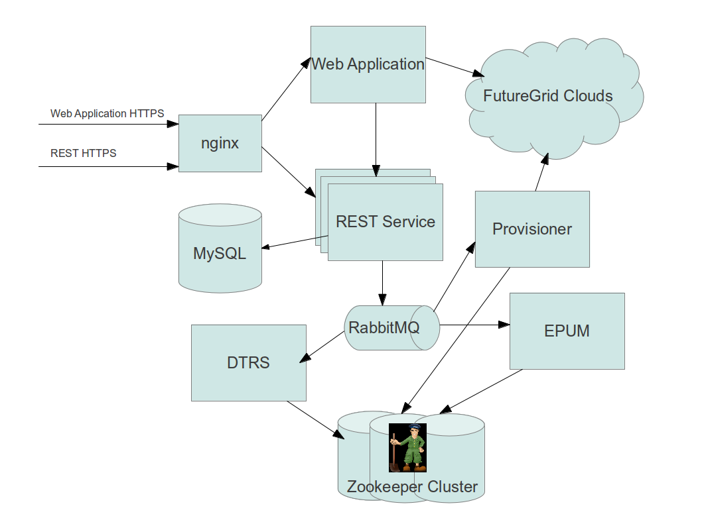

===========
Architecture
===========

Those interested in how the Nimbus Phantom service works under
the hood will find this page helpful.  Here we will provide a quick
introduction to how the service works.

User Interfaces
===============

We have two user interfaces: a REST API and a Web Application.  The 
web application is effectively a user of the REST API; however, to 
provide some conveniences it also speaks directly to the clouds on which
the user will be running VMs.  The web application was created using the 
`Django <https://www.djangoproject.com/>`_ framework and is running 
inside a VM on FutureGrid's hotel cloud.  The application is backed
by a MySQL server.

The REST API is a Python `WSGI <http://wsgi.readthedocs.org/en/latest/index.html>`_ application.  It is run using the `cherrypy <http://www.cherrypy.org/>`_ 
framework inside a FutureGrid VM.  The REST service requires no 
state to do its work.  All of the state is contained inside other 
system components.  This allows for horizontal scaling and high levels
of replication.  However, there is one exception to this.  At the moment
all user authentication information is contained in a MySQL server.
We did this because it was much more convenient for our FutureGrid users to
interact with an existing account system than it was to use a highly 
available one.  Further, the MySQL server can easily handle orders of
magnitude beyond our predicted load, or any load that the underlying compute
resources can handle.

nginx
-----

Both the REST service and the web application are fronted by an nginx
load balancer.  This is done so that we can dynamically add and subtract
replicated instances of each service without interrupting users.
Further, this allows us to use VMs (with potentially changing IP addresses)
to handle the workload.  nginx handles SSL and holds the certificates
needed in a safe and known location.

RabbitMQ Message Space
======================

All internal components interact with each other via AMQP message space.
A `RabbitMQ <http://www.rabbitmq.com/>`_ server is running inside of a 
VM.  This approach allows us to scale up the messaging system and the 
components interacting with it.

ZooKeeper
=========

All of our components use a `ZooKeeper <http://zookeeper.apache.org/>`_ 
cluster for persistent storage.  This again allows for high scalability.

DTRS
====

EPUM
====

Provisioner
===========

