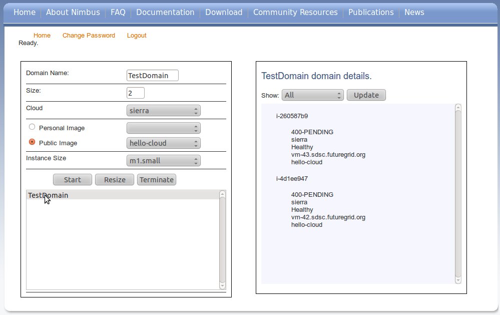

===============
Web Application
===============

The best way to get familiar with the Nimbus Auto-scale service is to
check out the web application 
`here <https://svc.uc.futuregrid.org:8440/phantom>`_.

In order to use the web application you will need a `FutureGrid account 
<https://portal.futuregrid.org/user/register>`_ and a Phantom account.
To get a Phantom account please send email requesting one to 
workspace-user@globus.org.

Login
=====

Once you have the needed accounts you can log into the web application.
You will first be presented with a login screen similar to the
below:

.. image:: images/phantom_login.png
   :width: 1004
   :height: 248

If you have forgotten your account information you can click on the 
`Forgot Password <https://svc.uc.futuregrid.org:8440/accounts/reset_password/>`_
link.  After successfully logging in you will be presented with 
a screen similar to the following:

.. image:: images/phantom_main.png

Launch a domain
===============

At this point you can use the application to create new domains, monitor
existing domains, resize existing domains, and terminate existing domains.

To launch a new domain the first thing you should do is select a name for
it and enter it into the 'Domain Name' text box.  After that set the 
number of VMs you wish to run in this domain by typing that number in the 
"Size" box.  

Next select one of the FutureGrid clouds on which your domain will run.
There are four clouds, hotel, sierra, alamo, and foxtrot.  Note that as
you select different clouds the 'Person Images' and 'Public Images' 
boxes change.  This is because the set of images available on each cloud
need not be identical.

Once you have selected a cloud select an image that you wish to run.  You 
may choose from the list of publicly available images (images that are
available for all cloud users) or from your set of personal images (images
that are just for your use).

The final step is to select and instance type and click 'Start'.  Once you 
start it you will notice that your 'domain name' is now listed in the 
lowest box on the left panel.  This means that the system is aware of your
domain and running it.  Click on your domain name and you should see
a screen similar to the one below:

Notice that details about your domain are listed in the right pane.  Each
entry represents the state of one of your requested VMs.  When a VM
instance is listed as 'RUNNING' it is ready for use (you can ssh into it).
Click the 'Update' Button until you see your VMs are all running.

Resize a domain
===============

Select your domain from the list in the lowest box in the bottom left pane.
When you select it notice that all the options for running a domain are
set to represent your domain, including the 'Size' field.  If you wish, you
can change the size.  Simply enter a new value and click the 'Resize'
button.  You should now see the status car working and changes on the right
pane begin to take effect.

Delete a domain
===============

When you wish to terminate a VM simply select it and click the terminate 
button.  This will begin terminating all of the VMs under the domain
and stopping all other processes associated with the domain.  It may
take a few moments to complete and you may need to click update to see
the results of the operation.
