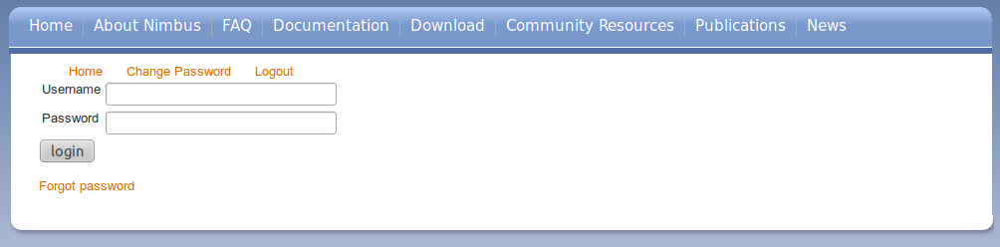
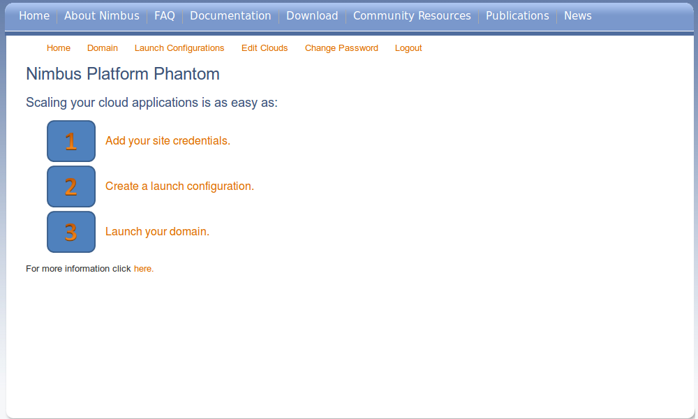
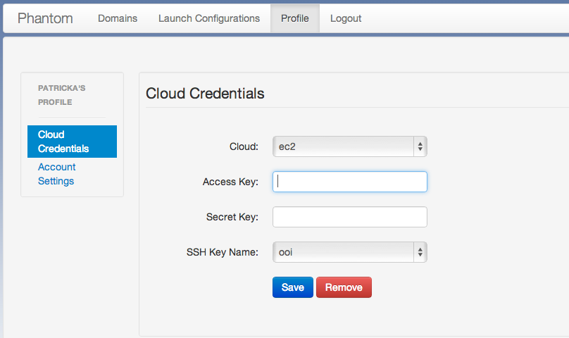
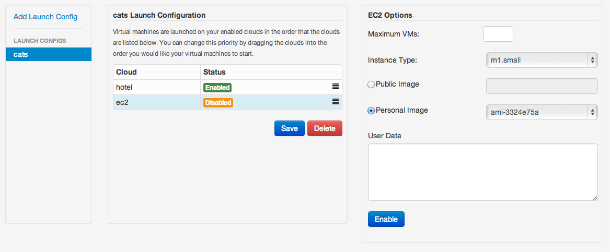
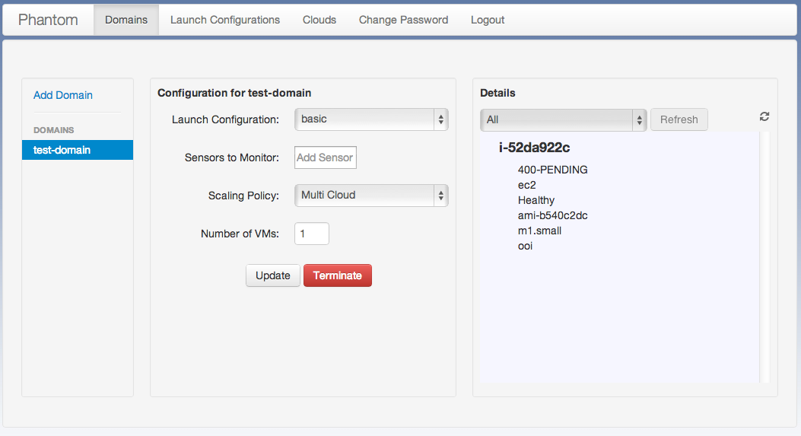

==================
Phantom Quickstart
==================

The best way to get familiar with Phantom is to
`try it out <https://phantom.nimbusproject.org/>`_.

* `Getting Access`_
* `Login`_
* `Configuring your Profile`_
* `Creating a Launch Configuration`_
* `Launching a Domain`_
* `Updating a Domain`_
* `Terminating a Domain`_

Getting Access
==============

Phantom has been deployed as a service on `FutureGrid <https://futuregrid.org/>`_
and you can start using it there.
In order to use Phantom, you will need a Phantom account and accounts
on clouds you want to use with Phantom.

You can either apply for a Futuregrid account, and get access through Futuregrid,
or if you do not plan on using Futuregrid, you can sign up for Phantom on its own.

Register a Phantom Account with Futuregrid
------------------------------------------

FutureGrid provides several different IaaS clouds that you can use with
Phantom.  Requesting a FutureGrid account will give you access to all
FutureGrid clouds.  Thus your first step to gain access is to `request a
FutureGrid account <https://portal.futuregrid.org/user/register>`_. Once you
have a FutureGrid account, you will need to join an existing FutureGrid project
or to `create your own <https://portal.futuregrid.org/node/add/fg-projects>`_.

Once you are in an active FutureGrid project, you can get a Phantom account by
emailing `nimbus@mcs.anl.gov <mailto:nimbus@mcs.anl.gov>`_.  We will create
your Phantom account and send you instructions on how to use Phantom.

Register a Phantom Account without Futuregrid
---------------------------------------------

If you would rather not sign up for Phantom through Futuregrid, you can sign up
for Phantom without it, and use it with Amazon EC2. To do so, visit the `Sign Up
<https://phantom.nimbusproject.org/accounts/signup/>`_ page, and create your
account. Once your account is approved, you should receive an email with further
instructions.

Once you have set up your account, log on to `Phantom <https://phantom.nimbusproject.org/>`_.

Login
=====

Once you have the needed accounts you can log in.
You will first be presented with a login screen:

If you have forgotten your account information you can click on the 
`Forgot Password <https://phantom.nimbusproject.org/accounts/reset_password/>`_
link.  After logging in you will see the home page:

This page should guide you through the steps to start launching sets of
virtual machines, which are called Domains in Phantom.

Configuring your Profile
========================

Your profile is where your overall Phantom settings are stored. You can change
your Phantom password here, and more importantly, you can set up your credentials
with each cloud you use. In addition to setting up your cloud credentials, if you
would like to use phantom with Chef, you can set up those credentials as well.

To set up your cloud credentials, 
go to your `Profile <https://phantom.nimbusproject.org/phantom/profile>`_
page and add your cloud credentials for each cloud you intend to use:

All FutureGrid accounts should come pre-loaded with your credentials.  If you
wish to use EC2 in addition to FutureGrid clouds,
you can add your credentials:

Adding EC2 Credentials
----------------------

1. Visit your `profile <https://phantom.nimbusproject.org/phantom/profile#cloud-credentials>`_
2. Select the EC2 cloud
3. Add your access key
4. Add your secret key
5. Click Save

Phantom will now fetch your ssh keys from EC2. If you haven't uploaded a key to
the clouds you want to use, please follow the instructions for `EC2
<http://docs.aws.amazon.com/AWSEC2/latest/UserGuide/generating-a-keypair.html#how-to-generate-your-own-key-and-import-it-to-aws>`_
and `FutureGrid OpenStack
<https://portal.futuregrid.org/manual/using-openstack-futuregrid#key_management>`_.
For Nimbus you can use `this script
<https://gist.github.com/oldpatricka/3752775>`_ (requires Python and Boto).
When this is done:

6. Choose an ssh keyname for your VMs
7. Click Save again

Adding Chef Credentials
-----------------------

Open your knife.rb configuration file. Normally this is in ``~/.chef/`` on Mac and
Linux, and ``c:\Users\<username>\.chef\`` on Windows. If you are using `Hosted
<<<<<<< HEAD
Chef <http://www.opscode.com/hosted-chef/>`_, you can download this file from the
`Organizations <https://manage.opscode.com/organizations>`_ page.
=======
Enterprise Chef <http://www.getchef.com/enterprise-chef/>`_, you can download
this file from the `Organizations <https://manage.opscode.com/organizations>`_
page.
>>>>>>> refs/remotes/nimbusproject/master

From this file you can read your Chef Server URL (``chef_server_url``), Chef
Client Name (``node_name``) and Chef Validation Client Name
(``validation_client_name``).

<<<<<<< HEAD
You will also need your client key and validator key. From Hosted Chef, you
should have downloaded them when you set up your account and placed them in
your .chef directory. If you haven't, you can generate a new client key on the
`Change Password <https://www.opscode.com/account/password>`_ page, and a new
validator key on the `Organizations <https://manage.opscode.com/organizations>`_
page.

Now that we have these values, we can put them in our profile:

1. Visit your `profile <https://phantom.nimbusproject.org/phantom/profile#cloud-credentials>`_
2. Select Chef Credentials
3. Click "Add Chef Server"
4. Choose a name for your server, and click "Add Chef Server"
5. Add your Chef Server URL, Chef Client Name, and Chef Validation Client Name
6. Paste your Chef Client Key (usually in a .pem file in your .chef directory)
7. Paste your Chef Validator Key (usually in a .pem file in your .chef directory)
8. Click Save Credentials
=======
You will also need your client key and validator key. From Hosted Enterprise Chef, you
should have downloaded them when you set up your account and placed them in
your .chef directory. If you haven't, you can generate a new client key on the
Reset Key page found under the Users menu on the `Organizations
<https://manage.opscode.com/organizations>`_ page, and a new validator key on
the `Organizations <https://manage.opscode.com/organizations>`_ page.

Now that we have these values, we can put them in our profile:

1. Visit your `Chef Credentials <https://phantom.nimbusproject.org/phantom/profile#chef-credentials>`_
2. Click "Add Chef Server"
3. Choose a name for your server, and click "Add Chef Server"
4. Add your Chef Server URL, Chef Client Name, and Chef Validation Client Name
5. Paste your Chef Client Key (usually in a .pem file in your .chef directory)
6. Paste your Chef Validator Key (usually in a .pem file in your .chef directory)
7. Click Save Credentials

Adding an SSH Key
-----------------

Phantom requires a copy of your public SSH key to allow you to log in to VMs that
it starts for you. Often, you will have already uploaded an SSH key to the clouds
you want to use with Phantom, but if you haven't, Phantom provides a tool to do this.

If you haven't yet created an SSH key at all, the FutureGrid site has `good instructions
for creating an SSH key <https://portal.futuregrid.org/generating-ssh-keys-futuregrid-access>`_ .
Once you have your key, you can upload it by:

1. Set up one or more set of cloud credentials on the `Cloud Credentials <https://phantom.nimbusproject.org/phantom/profile#cloud-credentials>`_ page on your profile.
2. Go to the `Add SSH Key <https://phantom.nimbusproject.org/phantom/profile#add-ssh-key>`_ page in your profile.
3. Select the clouds you would like to upload to on the left
4. Enter a name for your key into the Name field 
5. Paste your key into the Key field. (Hint: on the Mac, you can type "pbcopy < ~/.ssh/id_rsa.pub" into your terminal to copy your key)
6. Click the "Upload SSH Key" button to upload your key

Once you have done this, you can enable the key by following the steps outlined above under
"Adding EC2 Credentials".
>>>>>>> refs/remotes/nimbusproject/master

Creating a Launch Configuration
===============================

Now that your credentials are configured, you can create a launch configuration.
A launch configuration is a list of which VM images you would like to start on
which clouds. You will provide an ordering for the list of clouds to start VMs
on.

Go to the 
`Launch Configurations <https://phantom.nimbusproject.org/phantom/launchconfig>`_
page:

Create a Launch Configuration
-----------------------------

1. Click Add Launch Config
2. Name your Launch Configuration

Our example is named *testoverflow*.

Now we will create a list of clouds in the order we would like to have Phantom
use them. This way you can prioritize your preferred clouds, while still using
other clouds when your preferred ones are not available.

Adding a Cloud
--------------

1. Select a cloud from the list of clouds under *Launch Configuration*
2. Specify the maximum number of VMs you would like on this cloud (-1 means infinity)
3. Select an instance type (m1.small is a good choice if you have no preference)
4. Select the image you wish to launch. You can either pick a *Personal Image* from
   the list, or type in the name of a *Public Image* supplied by someone else.
   If you are using a FutureGrid cloud, you can use *hello-cloud*, for example.
5. If you like, you can provide User Data that will be provided on the VM via the
   EC2 or Nimbus metadata server.
6. Click *Enable* to add the cloud configuration to the list of clouds on the right.

You can now add additional clouds if you like by repeating the above steps.

Once you have enabled the clouds you would like to use, you can drag and drop
the clouds change the launch priority of these clouds. Phantom will try
to start as many VMs as it can (up to the maximum you specified) on the first
cloud in the list before starting VMs on the second cloud.

When you are happy with the order you have selected, click the *Save* button
Once saved,  you can now launch a domain using this launch
configuration.

<<<<<<< HEAD
Setting up Contextualization
----------------------------

If you would like to contextualize your virtual machines, you can do so using
either the plain user-data field, which will put the information on the cloud's
metadata server for access from the VM, or you can specify a Chef runlist and
dictionary of attributes. If you would like to know more about Chef, you can
visit `#LearnChef <https://learnchef.opscode.com/>`_.
=======
Appliances
----------

Appliances are ready-made launch configuration to help you start domains
without having to manually enter all the settings.  If you select an appliance,
the image and contextualization settings will already be configured for you. You
will only have to select the clouds you want to use, the maximum number of VMs
on each cloud, and the instance types.

Setting up Contextualization
----------------------------

Contextualization allows you to configure your virtual machines so that they
provide fully configured applications and services.

Contextualization is optional: you can leave the User Data field empty, or
select *None* as contextualization type.  If you would like to contextualize
your virtual machines, you can do so using several mechanisms:

* The plain user-data field will put the information on the cloud's metadata
  server for access from the VM
* You can specify a Chef runlist and dictionary of attributes. If you would
  like to know more about Chef, you can visit `#LearnChef
  <https://learnchef.opscode.com/>`_.
* You can *Phantomize* a VM which installs and runs tcollector for use with
  sensor autoscaling domains (see :doc:`sensors`)
>>>>>>> refs/remotes/nimbusproject/master

To set up plain user-data:

1. Select the Launch Configuration you would like to use, or make a new one
2. Under Contextualization Type, choose "User Data"
3. Fill in your user data under in the User Data field
4. Click Save

To set up Chef contextualization:

1. Select the Launch Configuration you would like to use, or make a new one
2. Under Contextualization Type, choose "Chef"
3. Fill in your Chef runlist (in json format)
4. Fill in your Chef attributes (in json format)
5. Click Save

<<<<<<< HEAD
=======
To set up *Phantomize*:

1. Select the Launch Configuration you would like to use, or make a new one
2. Under Contextualization Type, choose "Phantomize"
3. Click Save

.. note::

    Your virtual machine image must be configured to download and execute
    user-data on boot. This is done automatically if you have `cloud-init
    <http://cloudinit.readthedocs.org>`_ installed. OpenStack images are
    generally already configured to run cloud-init on boot.

>>>>>>> refs/remotes/nimbusproject/master
Launching a Domain
==================

Now that you have set up your credentials and created a launch configuration, 
you can launch and manage domains that will launch and monitor VMs for you.

To launch a new domain, go to the 
`domains <https://phantom.nimbusproject.org/phantom/domain>`_
page:

Creating a simple domain
------------------------

To create a domain:

1. Click *Add Domain*
2. Choose a name for the domain in the popup window
3. Pick the Launch Configuration you created earlier
4. Leave Sensors to Monitor blank for now
5. Make sure *Scaling Policy* is set to "Multi Cloud"
6. Type in the number of VMs you would like Phantom to start
7. Click *Start*

Phantom is now starting your Domain, and in turn, starting your VMs. You should
see the list of VMs that Phantom has started on the right under Details. This
information is updated automatically.

When you see that your VM is RUNNING, it is now ready to use.

Creating a sensor autoscaling domain
------------------------------------

If you would like to create a sensor autoscaling domain, ensure that you have
tcollector installed and configured on your VM image, or that you have used the
*Phantomize* contextualization. You can also use the hello-phantom.gz public
image on FutureGrid, as described on the :doc:`sensors` page.

Then:

1. Click *Add Domain*
2. Choose a name for the domain in the popup window
3. Pick the Launch Configuration you created earlier
4. Type a sensor to monitor (for instance *proc.loadavg.1min*) at the *Add
   Sensor* box, and then a space
5. Make sure *Scaling Policy* is set to "Sensor"
6. Fill out the sensor policy parameters:
   a) *Metric* is the metric to base scaling actions on
   b) *Cooldown* is the number of seconds Phantom should wait between scaling 
   actions. This prevents Phantom from starting and stopping VMs too often
   c) *Minimum* is the minimum number of VMs to maintain
   d) *Maximum* is the maximum number of VMs to start
   e) *Scale Up Threshold*: When the metric value is above this value, Phantom
   will start VMs to compensate
   f) *Scale Up By*: The number of VMs to start when the Scale Up Threshold is
   exceeded
   g) *Scale Down Threshold*: When the metric value is below this value, Phantom
   will terminate VMs to compensate
   h) *Scale Down By*: The number of VMs to terminate when the Scale Down Threshold is
   exceeded
7. Click *Start*

Updating a Domain
=================

Once you have started a Domain, you may wish to adjust the settings you picked 
earlier.

Changing the number of running VMs
----------------------------------

For example, you may wish to increase or decrease the number of VMs
that are running as a part of your domain. To do this:

1. Select your domain from the list of domains on the left
2. Change the number of VMs in the domain
3. Click Update

You should now see the status bar working and the details view should show the 
updated number of VMs.

Adding a sensor to monitor
--------------------------

If you would like to start monitoring specific sensors for your domain:

1. Select your domain from the list of domains on the left
2. Type the name of a tcollector sensor, like *proc.loadavg.1min* in the
   *Add Sensor* box, and then a space
3. Click Update

If your VM image has tcollector installed on it, you should now see the status
bar working and the details view should show the sensor value.

You can discover other sensors available to you by typing partial names of
sensors in the *Add Sensor* box, and seeing a list of what is available. Some
good prefixes to explore are *df*, *proc*, *net*, and *io*. Each of these prefixes
has a number of interesting metrics available. For example, *df.1kblocks.used*,
for used disk space, *proc.loadavg.1min* for load, or *proc.meminfo.highfree*
for available memory.

Terminating a Domain
====================

When you wish to terminate a domain:

1. Select your domain from the list of domains on the left
2. Click Terminate

You should now see the status bar working, and soon, your domain, as well as 
all of the VMs started by it, will be terminated.
