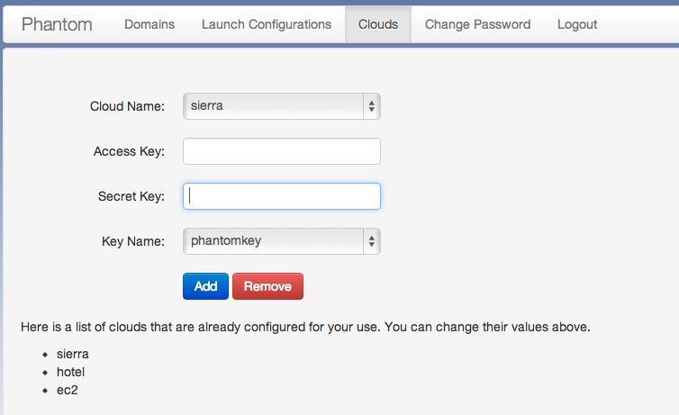

===============
Web Application
===============

The best way to get familiar with the Nimbus Phantom service is to
check out the web application 
`here <https://svc.uc.futuregrid.org:8440/phantom>`_.

In order to use the web application you will need a `FutureGrid account 
<https://portal.futuregrid.org/user/register>`_ and a Phantom account.
To get a Phantom account please send email requesting one to 
workspace-user@globus.org.

Login
=====

Once you have the needed accounts you can log into the web application.
You will first be presented with a login screen similar to the one
below:

.. image:: images/phantom_login.png
   :width: 502
   :height: 124

If you have forgotten your account information you can click on the 
`Forgot Password <https://svc.uc.futuregrid.org:8440/accounts/reset_password/>`_
link.  After successfully logging in you will be presented with the landing
page:

.. image:: images/phantom_home.png
   :width: 500
   :height: 313

That screen explains the basic steps.  The first thing you need to do is
go to the 
`Edit Clouds <https://svc.uc.futuregrid.org:8440/phantom/sites>`_
page and add your site credentials.  The page should look like this:

All FutureGrid accounts should come pre-loaded with your credentials.  If you
wish to use EC2 you can add your credentials by selecting the EC2 cloud,
adding your access and secret key, and then click save.  Once the system
has your keys you can select the keyname that you wish to use.  Select it
and click save a second time.

Create a launch configuration
=============================

Once you have all of your site information configured it is time to create
a launch configuration.  Got to the 
`Launch Configuration <https://svc.uc.futuregrid.org:8440/phantom/launchconfig>`_
page and you will see a screen like the following:

.. image:: images/phantom_lc.png
   :width: 500
   :height: 313

This is where you create a launch plan.  The first thing to do is to select
a name for the launch configuration, for this example we will use 
*testoverflow*.   Now the ordered list of clouds must be created.  On the left
panel *Cloud Options* select a cloud from the list.  Then give it a max
number of VMs that you will allow on that cloud (-1 means infinity).  
Select an instance type (if you are unsure choose m1.small).  Finally 
select the image you wish to launch.  In the combo box labeled * Personal Image*
you will find a list of all of the images you have created and uploaded.
If you have not yet done this you can specify the name of a public image.
If you are using a FutureGrid cloud enter *hello-cloud*. 

Click *Add* to add the cloud configuration to the list.  Now you can configure
the next cloud by repeating the above process with another cloud in the 
Cloud Options panel. 

Once you have added all of the clouds you can use the *Up* and *Down* buttons
to order them.  When you are happy with the order click the *Save* button
at the top.  Once successfully saved you can launch a domain using this launch
configuration.

Launch a domain
===============

At this point you can use the application to create new domains, monitor
existing domains, resize existing domains, and terminate existing domains.

To launch a new domain go to the 
`domains <https://svc.uc.futuregrid.org:8440/phantom/domain>`_
page.  You should see something like this:

.. image:: images/phantom_lc.png
   :width: 500
   :height: 313

The first thing you should do is select a name for
it and enter it into the 'Domain Name' text box.  After that set the 
number of VMs you wish to run in this domain by typing that number in the 
"Size" box.  Finally select the launch configuration you wish to use.
In the screen above we selected *testoverflow*.

The final step is to select click 'Start'.  Once you 
start it you will notice that your 'domain name' is now listed in the 
lowest box on the left panel.  This means that the system is aware of your
domain and running it.  

Click on your domain name and you should see
the domain details panel populated with information about your domain.
Each
entry represents the state of one of your requested VMs.  When a VM
instance is listed as 'RUNNING' it is ready for use (you can ssh into it as
root).
Click the 'Update' Button until you see your VMs are all running.

Resize a domain
===============

Select your domain from the list in the lowest box in the bottom left pane.
When you select it notice that all the options for running a domain are
set to represent your domain, including the 'Size' field.  If you wish, you
can change the size.  Simply enter a new value and click the 'Resize'
button.  You should now see the status bar working and changes on the right
pane begin to take effect.

Delete a domain
===============

When you wish to terminate a domain simply select it and click the terminate
button.  This will begin terminating all of the VMs under the domain
and stopping all other processes associated with the domain.  It may
take a few moments to complete and you may need to click update to see
the results of the operation.
