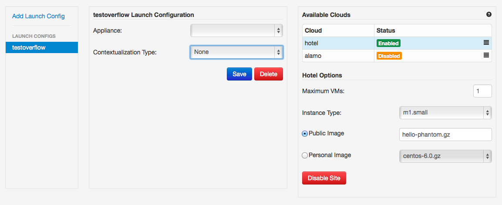

===============
Phantom Web App
===============

The best way to get familiar with the Nimbus Phantom service is to
check out the Phantom Web App
`here <https://svc.uc.futuregrid.org:8440/phantom>`_.

In order to use the Phantom Web App you will need a `FutureGrid account 
<https://portal.futuregrid.org/user/register>`_ and a Phantom account.
To get a Phantom account, request to join the `Nimbus Auto Scale
<https://portal.futuregrid.org/projects/224>`_ project.
We will create your Phantom account when your project join request has been
accepted.

Login
=====

Once you have the needed accounts you can log in.
You will first be presented with a login screen:

.. image:: images/phantom_login.png
   :width: 502

If you have forgotten your account information you can click on the 
`Forgot Password <https://svc.uc.futuregrid.org:8440/accounts/reset_password/>`_
link.  After logging in you will see the home page:

.. image:: images/phantom_home.png
   :width: 500

This page should guide you through the steps to start launching sets of
virtual machines, which are called Domains in Phantom.

Setting up your Cloud Credentials
=============================

Go to your `Profile <https://svc.uc.futuregrid.org:8440/phantom/profile>`_
page and add your cloud credentials for each site you intend to use:

.. image:: images/phantom_profile.png
   :width: 500

All FutureGrid accounts should come pre-loaded with your credentials.  If you
wish to use EC2 in addition to FutureGrid clouds,
you can add your credentials:

Adding EC2 Credentials
----------------------

1. Select the EC2 cloud
2. Add your access key
3. Add your secret key
4. Click Save

Phantom will now fetch your ssh keys from EC2. When this is done:

5. Choose an ssh keyname for your VMs
6. Click Save again

Creating a Launch Configuration
=============================

Now that your credentials are configured, you can create a launch configuration.
A launch configuration is a list of which VM images you would like to start on
which clouds. You will provide an ordering for the list of clouds to start VMs
on.

Go to the 
`Launch Configurations <https://svc.uc.futuregrid.org:8440/phantom/launchconfig>`_
page:

First, name your launch configuration. Type the name in the top field. This
example will be named 
*testoverflow*.

Now we will create a list of clouds in the order we would like to have Phantom
use them. This way you can prioritize your preferred clouds, while still using
other clouds when your preferred ones are not available.

Adding a Cloud
--------------

1. Select a cloud from the list of clouds under *Cloud Options*
2. Specify the maximum number of VMs you would like on this cloud (-1 means infinity)
3. Select an instance type (m1.small is a good choice if you have no preference)
4. Select the image you wish to launch. You can either pick a *Personal Image* from
   the list, or type in the name of a *Public Image* supplied by someone else.
   If you are using a FutureGrid cloud, you can use *hello-cloud*, for example.
5. If you like, you can provide User Data that will be provided on the VM via the
   EC2 or Nimbus metadata server.
6. Click *Add* to add the cloud configuration to the list of clouds on the right.

You can now add aditional clouds if you like by repeating the above steps.

Once you have added the clouds you would like to use, you can use the *Up* and
*Down* buttons to change the launch priority of these clouds. Phantom will try
to start as many VMs as it can (up to the maximum you specified) on the first
cloud in the list before starting VMs on the second.

When you are happy with the order you have selected, click the *Save* button
at the top.  Once saved,  you can now launch a domain using this launch
configuration.

Launching a domain
==================

Now that you have set up your credentials and created a launch configuration, 
you can launch and manage domains that will launch and monitor VMs for you.

To launch a new domain, go to the 
`domains <https://svc.uc.futuregrid.org:8440/phantom/domain>`_
page:

.. image:: images/phantom_domain.png
   :width: 500

Creating a simple domain
------------------------

To create a domain:

1. Click *Add Domain*
2. Choose a name for the domain in the popup window
3. Pick the Launch Configuration you created earlier
4. Leave Sensors to Monitor blank for now
5. Make sure *Scaling Policy* is set to "Multi Cloud"
6. Type in the number of VMs you would like Phantom to start
7. Click *Start*

Phantom is now starting your Domain, and in turn, starting your VMs. You should
see the list of VMs that Phantom has started on the right under Details. This
information is updated automatically.

When you see that your VM is RUNNING, it is now ready to use.

Creating a sensor autoscaling domain
------------------------------------

If you would like to create a sensor autoscaling domain, ensure that you have
tcollector installed and configured on your VM image. You can also use the
hello-phantom.gz public image on FutureGrid, as described on the
:doc:`sensors`
page.

Then:

1. Click *Add Domain*
2. Choose a name for the domain in the popup window
3. Pick the Launch Configuration you created earlier
4. Type a sensor to monitor (for instance *proc.loadavg.1min*) at the *Add
   Sensor* box, and then a space
5. Make sure *Scaling Policy* is set to "Sensor"
6. Fill out the sensor policy parameters:
   a) *Metric* is the metric to base scaling actions on
   b) *Cooldown* is the number of seconds Phantom should wait between scaling 
   actions. This prevents Phantom from starting and stopping VMs too often
   c) *Minimum* is the minimum number of VMs to maintain
   d) *Maximum* is the maximum number of VMs to start
   e) *Scale Up Threshold*: When the metric value is above this value, Phantom
   will start VMs to compensate
   f) *Scale Up By*: The number of VMs to start when the Scale Up Threshold is
   exceeded
   g) *Scale Down Threshold*: When the metric value is below this value, Phantom
   will terminate VMs to compensate
   h) *Scale Down By*: The number of VMs to terminate when the Scale Down Threshold is
   exceeded
7. Click *Start*

Update a domain
===============

Once you have started a Domain, you may wish to adjust the settings you picked 
earlier.

Changing the number of running VMs
----------------------------------

For example, you may wish to increase or decrease the number of VMs
that are running as a part of your domain. To do this:

1. Select your domain from the list of domains on the left
2. Change the number of VMs in the domain
3. Click Update

You should now see the status bar working and the details view should show the 
updated number of VMs.

Adding a sensor to monitor
--------------------------

If you would like to start monitoring specific sensors for your domain:

1. Select your domain from the list of domains on the left
2. Type the name of a tcollector sensor, like *proc.loadavg.1min* in the
   *Add Sensor* box, and then a space
3. Click Update

If your VM image has tcollector installed on it, you should now see the status
bar working and the details view should show the sensor value.

Terminate a domain
===============

When you wish to terminate a domain:

1. Select your domain from the list of domains on the left
2. Click Terminate

You should now see the status bar working, and soon, your domain, as well as 
all of the VMs started by it, will be terminated.
