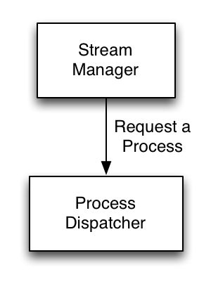
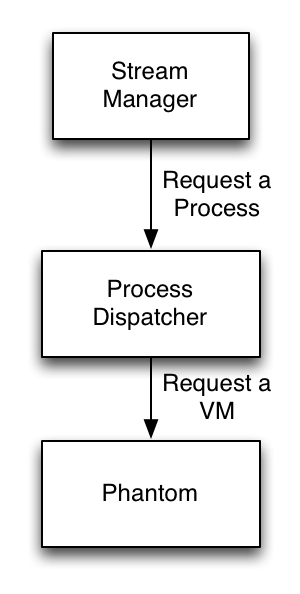
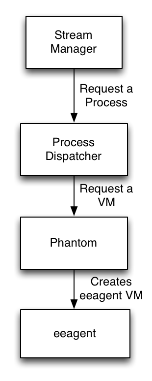
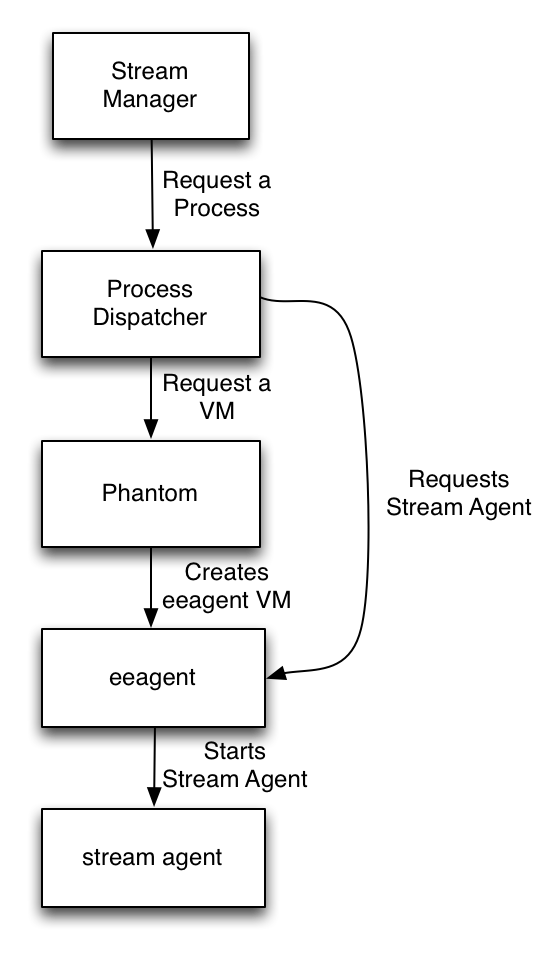

.. _process-dispatcher-introduction:

===============================
Process Dispatcher Introduction
===============================

The Process Dispatcher is a system for managing processes on virtual machines.
It takes process requests from the Stream Management Framework, and then
requests virtual machines from the Phantom Resource Management Platform, and
communicates with an agent on the virtual machine which runs those processes.

It is similar to systems like
`HTCondor <http://research.cs.wisc.edu/htcondor/>`_ and `Torque
PBS <http://www.adaptivecomputing.com/products/open-source/torque/>`_. The
primary difference between these systems and the Process Dispatcher is their
intention. The Process Dispatcher is intended to run service-like processes on
a dynamic system of virtual machines, rather than running batch processes.
`Cloud Scheduler <https://github.com/hep-gc/cloud-scheduler>`_ is similar to the
combination of Process Dispatcher and Phantom, however as works with Condor to
manage jobs, it is more suited to running thousands of batch jobs than
individual services.

The Process Dispatcher has two primary objects that it works with: Process Definitions and Processes.

A process definition describes the process that the Process Dispatcher should run. It contains the path to the process that should be run, as well as any arguments that should be fed to the process. The Process represents a queued or running process.

Using the Process Dispatcher
----------------------------

The Process Dispatcher provides a `Dashi interface <https://github.com/nimbusproject/dashi>`_
interface to control it, along with a command line tool which makes use of this API on the backend.
Dashi is a Remote Procedure Call (RPC) interface built on top of the `Kombu Messaging Library <http://kombu.readthedocs.org/en/latest/>`_. For an example of how to use it, see the `Process Dispatcher client <https://github.com/nimbusproject/epu/blob/master/epu/dashiproc/processdispatcher.py#L244-L315>`_ in the Process Dispatcher code.

The Stream Manager uses the Process Dispatcher Dashi API when communicating with it.

Process Dispatcher Dashi API
````````````````````````````
::

    create_definition(definition_id, definition_type, executable, name=None, description=None)

    Create a Process Definition.

    Parameters:

    definition_id: (preferably) a uuid string that provides a unique ID for the definition
    definition_type: Always "supd" which means supervisord-monitored process
    executable: A dictionary that describes a Process definition. The syntax in json:
        {
            "exec": "/path/to/process",
            "argv": [
                "--list of",
                "--command line",
                "--options"
            ]
        }
    name: (optional) name of the process definition as a string
    description: (optional) description of the process as a string

::

    describe_definition(definition_id)

    Describe a Process Definition

    Parameters:

    defintion_id: The id of the definition you would like to describe as a string

::

    update_definition(definition_id, definition_type, executable, name=None, description=None)

    Update a Process Definition

    Parameters:

    definition_id: (preferably) a uuid string that provides a unique ID for the definition
    definition_type: Always "supd" which means supervisord-monitored process
    executable: A dictionary that describes a Process definition. The syntax in json:
        {
            "exec": "/path/to/process",
            "argv": [
                "--list of",
                "--command line",
                "--options"
            ]
        }
    name: (optional) name of the process definition as a string
    description: (optional) description of the process as a string

::

    remove_definition(definition_id)

    Remove a Process Definition

    Parameters:

    defintion_id: The id of the definition you would like to remove as a string

::

    list_definitions()

    List all Process Definitions

::

    create_process(upid, definition_id, name=None)

    Create a Process. (Note this will not actually cause the process to start. For that, see schedule_process).

    Parameters:

    definition_id: The id of the definition you would like to create as a string
    name: (optional) name of the process you would like to create as a string

::

    schedule_process(upid, definition_id=None, configuration=None, subscribers=None, constraints=None, queueing_mode=None, restart_mode=None, execution_engine_id=None, node_exclusive=None, name=None)

    Schedule a Process.

    Parameters:

    upid: (preferably) a uuid string that provides a unique ID for the definition
    configuration: a dictionary of values that provides configuration for the process
    subscribers: (deprecated) a list of subscribers to receive notifications about this process
    constraints: a dictionary of constraints restricting which eeagent a process can be scheduled to
    queueing_mode: when a process can be queued
    restart_mode: when and if failed/terminated procs should be restarted
    execution_engine_id: dispatch a process to a specific eea
    node_exclusive: property that will only be permitted once on a node
    name: a (hopefully) human recognizable name for the process

::

    describe_process(upid)

    Describe the properties of a process.

    parameters:

    upid: (preferably) a uuid string that provides a unique id for the definition

::

    describe_processes()

    Return a list of all of the processes in the system.

::

    restart_process(upid)

    Restart a currently running process. Can help with stuck of non-responding processes.

    Parameters:

    upid: (preferably) a uuid string that provides a unique id for the definition

::

    terminate_process(upid)

    Terminate a currently running process.

    Parameters:

    upid: (preferably) a uuid string that provides a unique id for the definition

::

    dump()

    Provide debugging information about the state of the Process Dispatcher


Appendix: How it works
----------------------

The process dispatcher works as follows:

*Step 1*: The Stream Manager requests a Stream Agent process from the Process Dispatcher:



*Step 2*: The Process Dispatcher requests a VM from Phantom to run the process:



*Step 3*: Phantom Starts a VM and runs the eeagent on the VM:



*Step 4*: The Process Dispatcher requests a Stream Agent process run on the eeagent:



(PDA: Would an API listing be helpful here? or is a high level overview enough)
